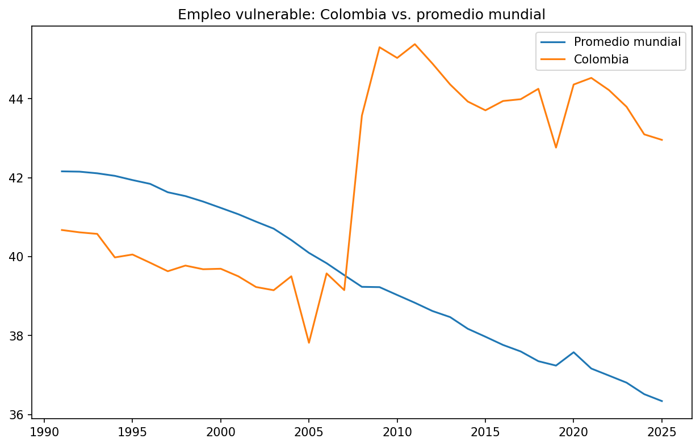

# World Bank Macroeconomic Indicators Dashboard

An interactive dashboard for exploring macroeconomic, labor-market, and social indicators across World Bank economies. It compares indicator trends over time and includes country maps, latest-value rankings, distributions, multi-indicator profiles, scatter plots, correlations, and filtered data export.

**Live app:** [Add the Streamlit Community Cloud link here](#)



## What the project covers

The dashboard uses 14 World Bank indicators, including GDP per capita, GDP growth, consumer price inflation, unemployment, labor-force participation, vulnerable employment, education expenditure, the Gini index, and multidimensional poverty. The checked-in `data.parquet` contains 17,490 economy-year rows across 265 World Bank economies, covering 1960–2025. An economy can be a country or a regional/income aggregate.

Many indicators have substantial gaps, especially multidimensional poverty and the Gini index. The dashboard therefore shows available observations and may use a different latest year for each economy and indicator. Comparisons should be interpreted with those coverage differences in mind.

## Run locally

Requires Python 3.10 or newer.

```bash
git clone <repository-url>
cd <repository-directory>
python -m venv .venv
source .venv/bin/activate        # Windows: .venv\Scripts\activate
python -m pip install -r requirements.txt
streamlit run dashboard_macro.py
```

The app reads `data.parquet` from the repository root. `Processing.ipynb` contains the data preparation work; the dashboard can also be run directly from the checked-in dataset.

## Dashboard features

- Filter by World Bank economy and year range.
- Compare one indicator as a time series and on a choropleth map.
- Rank economies by their latest available value and inspect distributions.
- Compare selected indicators in a normalized radar chart.
- Explore relationships between indicators with scatter and correlation plots.
- View and download the filtered data as CSV.

## Project files

- `dashboard_macro.py` — Streamlit application.
- `data.parquet` — merged dataset used by the app.
- `csv_files/` — individual indicator datasets used in the preparation notebook.
- `Processing.ipynb` — data preparation notebook.
- `ensayo.ipynb` — exploratory analysis and static visualizations.
- `requirements.txt` — Python dependencies.

## Data source and attribution

Data are from the [World Bank World Development Indicators](https://databank.worldbank.org/source/world-development-indicators). Indicator names and codes are defined in `Processing.ipynb`. Please consult the World Bank metadata for indicator definitions, units, and methodology.

## Notes

This project is for descriptive exploration. Correlations and trend lines do not establish causation, and World Bank estimates may be revised. The dashboard displays economy codes (for example, `COL`) rather than translated country names.
